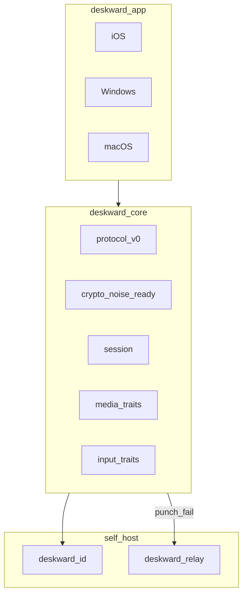

# Deskward Platform Design

**Date:** 2026-07-29  
**Status:** Approved  
**Scope:** Sıfırdan uzak masaüstü platformu (RustDesk referans, fork değil)

## 1. Amaç

Deskward, self-host öncelikli, Win/macOS host ve iOS/desktop controller destekli profesyonel uzak masaüstü platformudur. RustDesk Pro seviyesi uzun vadeli hedeftir; ilk gemi kişisel döngü (telefon/PC → ev Mac) ile doğrulanır.

## 2. Mimari



### Crate sorumlulukları

| Crate | Rol |
|-------|-----|
| `deskward-core` | Protokol, crypto, session, platform trait'leri |
| `deskward-id` | Kayıt, heartbeat, punch koordinasyonu |
| `deskward-relay` | P2P başarısız olunca byte relay |
| `deskward-app` | Flutter UI + Rust FFI (Faz 1+) |

## 3. Protokol v0

Transport: length-prefixed JSON (`deskward-core::protocol`), Faz 0. Faz 2+ CBOR veya protobuf.

### Mesajlar

| Tip | Yön | Açıklama |
|-----|-----|----------|
| `Register` | client → id | peer_id + public endpoint |
| `Heartbeat` | client → id | canlılık |
| `PunchRequest` | client → id | A, B'ye bağlanmak istiyor |
| `PunchResponse` | id → client | karşı taraf endpoint |
| `RelayAllocate` | client → relay | session_id al |
| `SessionOpen` | client ↔ client | oturum başlat |
| `SessionClose` | client ↔ client | oturum kapat |
| `HandshakeHello` | client ↔ client | nonce + peer_id |
| `HandshakeAck` | client ↔ client | imzalı nonce |

### Bağlantı sırası

1. Host ve controller `deskward-id`'ye register.
2. Controller `PunchRequest` gönderir.
3. ID her iki tarafa endpoint bildirir; UDP hole punch dener.
4. Başarısızsa `deskward-relay` üzerinden TCP relay.
5. `HandshakeHello` / `HandshakeAck` ile session key türetilir (Faz 0: Ed25519 imza; Faz 1+: Noise XX).

### Portlar (Deskward özel)

| Servis | TCP | UDP |
|--------|-----|-----|
| deskward-id | 29115 | 29116 |
| deskward-relay | 29117 | — |

## 4. Crypto ve tehdit modeli

**Faz 0:** Ed25519 kimlik + `HandshakeHello/Ack` ile MITM tespiti (server public key pin).  
**Faz 1+:** Noise Protocol XX handshake, ChaCha20-Poly1305 session AEAD.

**Güven varsayımları:**
- ID/relay sunucusu metadata görür (kim kime bağlandı); payload E2EE hedefi Faz 1.
- Unattended erişim: kalıcı şifre + host-side rate limit (Faz 1).
- Sunucu public key client config'de pinlenir (`DESKWARD_SERVER_PUBKEY`).

## 5. Platform katmanları

### Host (uzaktan kontrol edilen)

| Platform | Capture | Input | Faz |
|----------|---------|-------|-----|
| macOS | ScreenCaptureKit | CGEvent | 1 |
| Windows | DXGI / WGC | SendInput | 2 |
| iOS | — (controller only) | — | — |

### Controller

| Platform | Decode | Input send | Faz |
|----------|--------|------------|-----|
| Windows | HW H264 | mouse/keyboard | 1 |
| iOS | VideoToolbox | touch/gesture | 1 |
| macOS | HW H264 | mouse/keyboard | 2 |

Trait'ler: `deskward_core::media::{Capture, Encoder, Decoder}`, `deskward_core::input::{Inject, RemoteInput}`.

## 6. UI / UX

Kaynak: `design-system/deskward/MASTER.md` (Swiss Modernism 2.0, navy + teal accent).

### Ekranlar

1. **Home** — Deskward marka, kısa durum, ID alanı, “Bağlan” CTA, sunucu durumu.
2. **Session** — edge-to-edge video; kontroller alt chrome; kart yok.
3. **Settings** — custom ID/relay/key, unattended şifre, codec profili.

### Kurallar

- Touch hedef ≥ 44px (iOS).
- Motion 150–300ms; `prefers-reduced-motion` saygı.
- Token'lar theme'de; component'te ham hex yok.

## 7. Fazlar ve başarı kriterleri

| Faz | Çıktı | Başarı |
|-----|-------|--------|
| 0 | Monorepo, id, relay, handshake test | Docker'da servisler; lokal handshake PASS |
| 1 | macOS host, Win/iOS controller, Pi deploy | Gerçek Mac kontrolü LAN |
| 2 | Win host, dosya/clipboard, tray servis | Win↔Mac çift yön |
| 3 | Console, ACL, multi-relay, recording | Self-host Pro-lite |
| 4 | Store, fuzz, perf panel | Üretim sertleştirme |

## 8. Bilinçli sınırlar

- RustDesk protokol uyumu yok.
- Android V1–2 dışı.
- Linux host Faz 2+.
- AGPL fork yok; MIT lisans.

## 9. Repo düzeni

```
desk/
  Cargo.toml              # workspace
  deskward-core/
  deskward-id/
  deskward-relay/
  deskward-app/           # Flutter
  deploy/pi/
  design-system/deskward/
  docs/superpowers/
```
