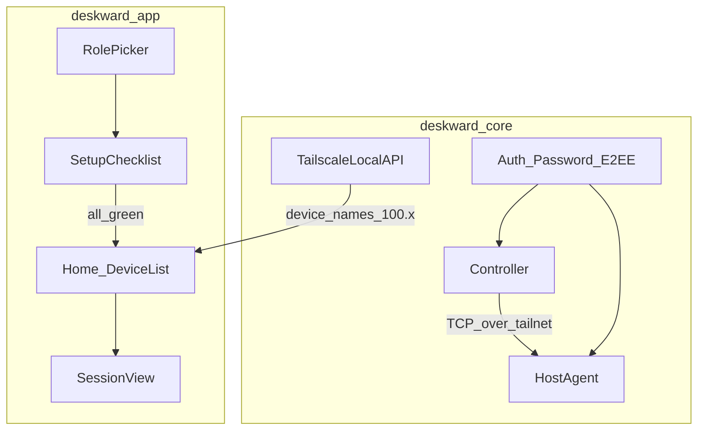

# Deskward — Tailscale-first onboarding & güvenlik tasarımı

**Date:** 2026-07-29  
**Status:** Approved  
**Product:** Deskward  
**Constraints:** VPS yok · Pi zorunlu değil · Tailscale omurga · Ultra güvenlik

---

## 1. Amaç

Kullanıcı Deskward’ı açınca **ne yapacağını anlar**, eksik adımlar **bitene kadar net checklist** görür, izinler alınmadan host **sessizce dinlemez**. Uzak erişim **Tailscale tüneli** üzerinden; kendi id/relay sunucusu yok.

**Controller cihazlar:** iOS, macOS, Windows.  
**Host cihazlar:** macOS (önce), Windows (sonra). iOS host değil.

---

## 2. Mimari (kilit)

| Katman | Görev |
|--------|--------|
| Tailscale | Cihaz bulma, tünel, NAT, gerekirse DERP |
| Deskward | Rol, izin, şifre, ekran, input, oturum |
| LocalAPI | `status` → online cihazlar, MagicDNS isim, IPv4 |

Kaynak: Tailscale LocalAPI (OS socket / localhost); Rust crate örn. `tailscale-localapi`.

**LAN shortcut (bonus):** Aynı Wi‑Fi’de mDNS — Tailscale şart değil; checklist’te “LAN hazır” opsiyonel satır. Dışarıdan erişim için Tailscale şart.

---

## 3. İlk açılış — rol seçimi (seçenek 3)

Tek ekran, marka Deskward üstte (hero), sonra tek soru:

**Bu cihaz ne yapacak?**

| Seçenek | Sonuç |
|---------|--------|
| **Uzaktan erişilecek** | Host checklist |
| **Başka cihaza bağlanacağım** | Controller checklist |
| **İkisi de** | Host checklist → Controller checklist (Mac/Win) |

iOS’ta sadece **controller** (host kartı disabled + kısa neden: “iOS uzaktan kontrol edilemez”).

Rol sonradan Ayarlar’dan değişir; checklist yeniden açılır.

---

## 4. Setup checklist motoru

### Kurallar

1. Ana Home (cihaz listesi / bağlan) **tüm zorunlu maddeler yeşil olana kadar kilitli**.
2. Her madde: durum ikonu (bekliyor / aksiyon gerekli / tamam) + tek cümle + birincil CTA.
3. Madde tamamlanınca anında yeşile döner (polling 1–2 sn veya OS callback).
4. Kullanıcı uygulamayı kapatıp açsa checklist kaldığı yerden devam.
5. “Neden lazım?” expand — güvenlik dili, korkutmadan.

### Host checklist (macOS)

| # | Madde | Kontrol | CTA |
|---|--------|---------|-----|
| H1 | Tailscale kurulu | LocalAPI erişilebilir | “Tailscale’i aç / indir” |
| H2 | Tailscale giriş + çevrimiçi | `BackendState == Running` | “Tailscale’de oturum aç” |
| H3 | Bu cihaz tailnet’te görünür | Self node name | — |
| H4 | Ekran Kaydı izni | TCC ScreenCapture | Sistem Ayarları’na derin link |
| H5 | Erişilebilirlik izni | Accessibility | Sistem Ayarları |
| H6 | (Opsiyonel) Giriş öğesi / arka plan | LaunchAgent | “Mac açılınca hazır olsun” |
| H7 | Kalıcı erişim şifresi | Hash kayıtlı | “Şifre belirle” (≥12, entropy) |
| H8 | Host dinleme açık | Agent bound + sadece tailnet | “Hazır” |

**H4 veya H5 yoksa host port dinlemez.** Sessiz açık host yasak.

### Controller checklist (iOS / macOS / Windows)

| # | Madde | Kontrol | CTA |
|---|--------|---------|-----|
| C1 | Tailscale kurulu | LocalAPI / iOS Tailscale app | İndir / aç |
| C2 | Tailscale çevrimiçi | Running | Oturum aç |
| C3 | En az 1 uzak cihaz görünür | Peer listesi | “Cihaz paylaşımı / davet” yardım |
| C4 | (İlk bağlanış) host şifresi | Kullanıcı girer | Bağlan |

Controller’da ekran kaydı istenmez.

### Windows host (Faz 2)

H4 → ekran yakalama izni modeli Win’e göre; H5 → UAC / input injection notları.

---

## 5. Home & bağlantı UX

Checklist yeşil → **Home**:

- Üst: Deskward + kısa durum şeridi (`Tailscale · Direkt` / `Tailscale · Relay` / `Çevrimdışı`)
- Liste: Tailscale isimleri (`ev-mac`, `ofis-win`) · online nokta · OS ikonu
- Satır: **Bağlan**
- Host modundaysa: “Senin ID / adın” + “Erişilebilir” toggle (kapatınca dinleme durur)
- Boş liste: “Tailscale’de cihaz yok” + paylaşım/davet rehberi (3 adım)

Session: edge-to-edge video; chrome’da bağlantı tipi + gecikme; kart yok.

---

## 6. Ultra güvenlik modeli

### İlkeler

1. **Defense in depth:** Tailscale WireGuard + Deskward oturum kimlik doğrulama (şifre) + ileride Noise/AEAD payload.
2. **Least privilege:** İzin yok → özellik kapalı; açıklama zorunlu.
3. **No silent expose:** Host, checklist tamam + kullanıcı “Erişilebilir” açık olmadan dinlemez.
4. **Secrets:** Kalıcı şifre sadece KDF (Argon2id veya scrypt) hash; keychain’de salt; plaintext log yok.
5. **Trust boundary:** Bağlantı sadece Tailscale CGNAT `100.x` / known peers; genel `0.0.0.0` public bind yok (LAN shortcut ayrı, kullanıcı onayı).
6. **Consent:** Varsayılan etkileşimli onay; katılımsız = bilinçli şifre + rate limit (5 fail → kilitle).
7. **Audit (yerel):** Son N bağlantı denemesi cihazda (kim, ne zaman, başarı/fail) — buluta gitmez.
8. **Clipboard/file:** Faz 2; varsayılan kapalı toggle.
9. **Updates:** İmzalı binary; ileride.
10. **Threat model doc:** `docs/security/threat-model.md` (ayrı kısa dosya Faz 0.5).

### Şifre kuralları

- Min 12 karakter; strength meter.
- “Katılımsız şifre” host’ta; controller’a asla sync edilmez (kullanıcı yazar veya keychain’e kendi kaydeder).
- Değiştirince eski oturumlar düşer.

### Tailscale güvenlik notu

- Paylaşım vs davet: tek PC için **device share** önerilir ([Tailscale inviting vs sharing](https://tailscale.com/docs/reference/inviting-vs-sharing)).
- Deskward, Tailscale auth’u yeniden icat etmez; kimlik Tailscale node’dan gelir.

---

## 7. UI / görsel

Kaynak: `design-system/deskward/MASTER.md` + Linear tool tonu (yoğun, sakin, tek aksan).

- Checklist: sol dikey adımlar veya üst progress `3/7` — kart yığını değil, tek sütun.
- Durum renkleri: bekliyor muted · aksiyon accent teal · tamam success · kritik destructive.
- Touch ≥ 44px (iOS).
- Motion 150–300ms; reduced-motion saygı.
- Mor/krem AI klişesi yok; glow yok.

Page override: `design-system/deskward/pages/onboarding.md` (bu spec ile uyumlu kısa kurallar).

---

## 8. Hata & boş durumlar (kullanıcı anlasın)

| Durum | Mesaj |
|-------|--------|
| Tailscale yok | “Bağlantı için Tailscale gerekli” + App Store / site |
| Tailscale kapalı | “Tailscale çevrimdışı — aç ve yeniden dene” |
| Peer offline | “Cihaz kapalı veya uykuda” |
| İzin yok | Checklist kırmızı madde; Home kilitli |
| Şifre yanlış | “Yanlış şifre” + kalan deneme |
| Relay | “Bağlantı yavaş olabilir (relay)” — bilgi, hata değil |

---

## 9. Fazlama (uygulama sırası)

| Adım | Çıktı |
|------|--------|
| Spec onay | Bu dosya |
| Impl plan | writing-plans: checklist engine + LocalAPI + Mac host path |
| Kod 1 | Rol picker + host checklist Mac |
| Kod 2 | Controller checklist + device list |
| Kod 3 | Session over Tailscale IP + şifre |
| Sonra | Win host, LAN shortcut, audit UI |

---

## 10. Bilinçli sınırlar

- VPS / Deskward Cloud yok.
- iOS host yok.
- Tailscale zorunlu (uzak erişim); kullanıcıya “neden” checklist’te anlatılır.
- “Hiç uygulama kurmadan bağlan” yok — Tailscale + Deskward şart.

---

## 11. Başarı kriterleri

- [ ] Rol seçmeden Home’a geçilemez (veya Ayarlar’dan rol atanana kadar).
- [ ] Host: H4/H5 yokken dinleme yok (test ile doğrula).
- [ ] Controller: peer listesi Tailscale isimleriyle dolar.
- [ ] Mac → Mac bağlantı denemesi checklist yeşilken mümkün.
- [ ] iOS’ta host seçeneği kapalı.
- [ ] Şifre plaintext disk/log’da yok.

---

## Onay

Bu draft’ı oku. Değişiklik varsa söyle. Onaylarsan `writing-plans` ile uygulama planı yazılır; sonra kod.
